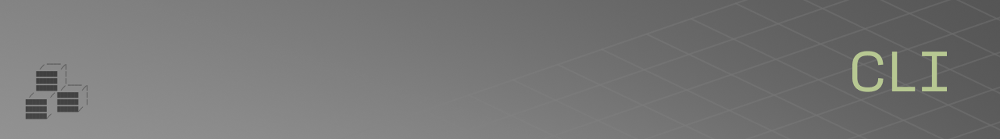

The Rulebricks CLI is a management utility for configuring and deploying private Rulebricks instances onto Kubernetes clusters you already control.

It focuses on generating valid Rulebricks configuration values, sizing the application from the selected cluster's available resources, and deploying the Helm chart.

## Installation

```bash
npm install -g @rulebricks/cli
```

## Prerequisites

You must have a valid **Rulebricks license key**
to deploy using this CLI. You will be
requested for this key during project
configuration.

You must also have an **available Kubernetes cluster** to deploy to. You can use the `cluster-setup` directory to easily create a standalone cluster for Rulebricks. These resources satisfy the minimum cluster requirements, role/identity resources, and object storage buckets required for a production deployment, and double as documentation for teams looking to deploy Rulebricks to an existing cluster.

Rulebricks requires TLS. You will require either external-dns on your cluster to automatically add DNS records, or you will need **access** to manually add **DNS records** for the subdomain(s) where you would like to access your private deployment from.

Finally, you will need to have the following tools installed and ready on your machine:

- **Node.js** >= 20
- **kubectl** - Kubernetes CLI
- **Helm** >= 3.0
- Cloud CLI (`aws`, `gcloud`, or `az`) configured for your provider if you want the wizard to discover clusters or refresh kubeconfig

## Cluster Setup

Create or select a Kubernetes cluster before running the CLI wizard. If you need a starting point, use the resources in `cluster-setup/`; they provide minimum compatible AWS, Azure, and GCP setup guidance plus optional access checks. Monitoring destinations are configured later by the CLI wizard and Helm values, not by these cluster setup files.

```bash
# AWS: optional access check, then create EKS with CloudFormation
AWS_REGION=us-east-1 bash cluster-setup/aws/check-aws-prereqs.sh
aws cloudformation create-stack \
  --stack-name rulebricks-cluster \
  --region us-east-1 \
  --template-body file://cluster-setup/aws/rulebricks-cluster.cfn.yaml \
  --parameters file://cluster-setup/aws/parameters.json \
  --capabilities CAPABILITY_NAMED_IAM

# Azure: optional access check, then deploy AKS with Bicep
az login
az account set --subscription <subscription-id>
AZURE_LOCATION=eastus bash cluster-setup/azure/check-aks-prereqs.sh
az group create --name rulebricks-rg --location eastus
az deployment group create \
  --resource-group rulebricks-rg \
  --template-file cluster-setup/azure/rulebricks-cluster.bicep \
  --parameters @cluster-setup/azure/parameters.json

# GCP: optional access check, then create GKE with gcloud
GCP_REGION=us-central1 bash cluster-setup/gcp/check-gke-prereqs.sh
# Follow cluster-setup/gcp/README.md for the gcloud create commands.
```

For enterprise deployments (private networking, managed Kafka/Redis/Postgres
toggles — all off by default — and hardened defaults), see
`cluster-setup/aws/enterprise/`, `cluster-setup/azure/enterprise/`, and
`cluster-setup/gcp/enterprise/`.

After the cluster exists, update kubeconfig, then run `rulebricks init`. The wizard can also refresh kubeconfig for EKS, GKE, or AKS when provider details are available.

## Quick Start

```bash
# Configuration wizard (generates values.yaml)
rulebricks init

# Deploy to your cluster
rulebricks deploy my-deployment
```

The generated Helm values pin one Rulebricks product version under
`global.version`. That single semantic version selects the app, HPS, and HPS
worker images together.

## Main Commands

| Command                     | Description                              |
| --------------------------- | ---------------------------------------- |
| `rulebricks init`           | Interactive setup wizard                 |
| `rulebricks deploy [name]`  | Deploy to Kubernetes                     |
| `rulebricks upgrade [name]` | Upgrade to a new version                 |
| `rulebricks destroy [name]` | Remove a deployment                      |
| `rulebricks status [name]`  | Show deployment health                   |
| `rulebricks logs [name]`    | Inspect services                         |
| `rulebricks open [name]`    | Open the generated configuration files   |
| `rulebricks backup [name]`  | Run an on-demand database backup         |
| `rulebricks restore [name]` | Restore the database from object storage |

Use `rulebricks -h` to explore all commands, and add `-h` to any command to learn more about a particular command's options.

## Monitoring

Self-hosted deployments enable Prometheus monitoring by default. The wizard only asks whether you want to configure a Prometheus `remote_write` destination; you can skip that step if you do not yet have AWS Managed Prometheus, Azure Monitor managed Prometheus, Grafana Cloud, or another remote-write-compatible backend ready.

By default, generated Helm values install `kube-prometheus-stack`, scrape Kubernetes and cluster metrics, and add Rulebricks scrape targets for:

- App/admin API health: request counts, latency histograms, coarse rejection counts, and frontend error counts.
- HPS rule-engine traffic: request counts, latency histograms, coarse rejection counts, Kafka worker wait time, bulk/parallel item volume, and memory cache stats.
- Supporting infrastructure where available: Kafka JMX, ClickHouse metrics when ClickHouse is enabled, and Traefik's Prometheus endpoint. Traefik's ServiceMonitor remains an explicit opt-in after Prometheus Operator CRDs are installed.

Metrics intentionally use low-cardinality labels such as route template, method, status class, operation, and rejection reason. They do not include API keys, users, organizations, IP addresses, raw URLs, rule slugs, flow slugs, or exception messages.

Useful PromQL examples:

```promql
histogram_quantile(0.95, sum(rate(rulebricks_hps_http_request_duration_seconds_bucket[5m])) by (le, route))
sum(rate(rulebricks_hps_rejections_total[5m])) by (route, reason)
histogram_quantile(0.95, sum(rate(rulebricks_hps_kafka_request_duration_seconds_bucket[5m])) by (le, operation))
sum(rate(rulebricks_hps_bulk_items_total[5m])) by (operation)
sum(rate(rulebricks_app_frontend_errors_total[5m])) by (source)
```

## Object Storage and Backups

The wizard now collects a shared object storage backend for every deployment. Rulebricks uses separate prefixes in that bucket for decision logs (`decision-logs/`) and self-hosted Supabase database backups (`db-backups/`).

Database backups are optional for self-hosted Supabase deployments. When enabled, the Helm chart schedules Barman base backups according to the configured cron schedule and retention window. You can also run `rulebricks backup <name>` to trigger an on-demand backup, or `rulebricks restore <name>` to list backups in object storage and interactively restore one after confirmation.

## Notes

There are a uniquely wide variety of customization options this CLI makes available (multi-cloud, hybrid vs. self-hosted database deployment, custom email templates, etc.), and not all combinations have been validated.

If you encounter any issue deploying your private Rulebricks cluster, please [email us](mailto:support@rulebricks.com) or [open an issue](https://github.com/rulebricks/cli/issues) and we will follow up promptly. If you are particularly familiar with helm/k8s, you are also free to review generated values.yaml files and reconcile them with our [Helm chart](https://github.com/rulebricks/helm).
